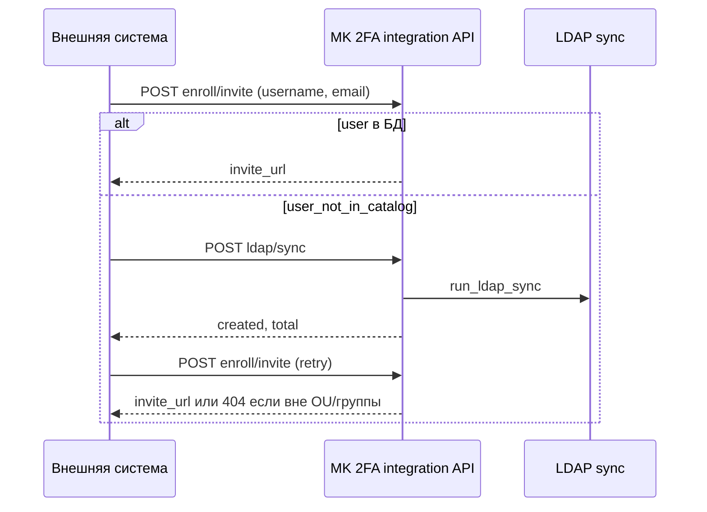

# Внешний API: приглашение на enroll / выпуск токена

_Зафиксировано: 2026-08-22 ~12:05 МСК. Обновлено: **2026-08-22 ~12:12 МСК** (ldap/sync, отдельный контейнер, prod TOTP). Статус: **идея / проектирование**, реализации нет._

## Запрос (Merl)

Другая система (HR, Service Desk, IAM, скрипт) должна **по API** инициировать:

- создание **ссылки enroll** (приглашение на выпуск TOTP-токена), и/или
- **отправку приглашения на email** (как кнопка «Отправить приглашение» в панели),

с **настраиваемыми ограничениями**:

- **allowlist IP** (откуда разрешены запросы);
- **API-ключ** (отдельный от логина админки).

### Уточнения Merl (2026-08-22)

| Тема | Решение |
|------|---------|
| Идентификаторы от вызывающей системы | **И логин AD (`username`), и email** — оба известны |
| Создание пользователя через API | **Нет** — integration **не создаёт** записи в `users` |
| Если пользователя нет в БД | **404** (или явная ошибка); вызывающая система **сама** решает, что делать |
| Альтернатива | Отдельный вызов **`ldap_sync`** (полная синхронизация из AD), затем повтор invite |
| Auto-create stub / on-demand LDAP lookup одного user | **Не делаем** в MVP |

**Важно:** `run_ldap_sync` подтягивает только пользователей по фильтрам панели (**OU / группа AD**). Если новый сотрудник вне фильтра — sync не поможет, нужна правка настроек LDAP sync, не обход через API.

---

## Возможно ли?

**Да.** Типовой паттерн для MK 2FA; большая часть логики уже есть — нужен отдельный HTTP-слой + настройки + ACL.

---

## Что уже есть в коде

### Invite / enroll (только через панель)

| Endpoint | Auth | Действие |
|----------|------|----------|
| `POST /api/users/{user_id}/invite-link` | JWT admin/operator | Ссылка enroll, audit `ENROLL_INVITE_LINK` |
| `POST /api/users/{user_id}/invite` | JWT admin/operator | Ссылка + SMTP (`send_invite_email`), audit `ENROLL_INVITE` |
| `GET/POST /api/public/enroll/{token}` | Публично (token в URL) | Страница enroll, LDAP auth, QR, confirm |

Ядро: `create_invite()`, `ensure_totp_pending()`, TTL из `Policy.enroll_invite_ttl_seconds` (`default_policy`).

Файлы: `api/app/routers/admin.py`, `api/app/enroll_service.py`, `api/app/mail_service.py`.

### Преcedent: internal token (RADIUS)

`/internal/radius/*` — не JWT панели, а **`X-Internal-Token`** / `Authorization: Bearer` + `INTERNAL_API_TOKEN` (`.env` / `host.env`).

Файлы: `api/app/internal_token.py`, `api/app/routers/radius.py`.

**IP на internal API сейчас не проверяется** — ACL только для NAS на RADIUS gateway (`radius.allowed_clients`).

### ACL по IP (готовый код)

`api/app/radius_acl.py`: `parse_allowed_clients()`, `is_client_allowed(ip, rules)` — IP и CIDR, тот же формат что «Разрешённые NAS» в настройках.

---

## Чего нет (нужно добавить)

1. **Отдельный router** — не смешивать с JWT `/api/users/...` (иначе внешняя система = полные права оператора).
2. **Свой API-ключ** — не переиспользовать `INTERNAL_API_TOKEN` (RADIUS и HR — разные зоны компрометации).
3. **Allowlist IP** для integration endpoints — в `system_settings` + UI (вкладка «Интеграции» / «Доступ»).
4. **Идентификация пользователя** — в теле запроса **`username` + `email`**; поиск по `ad_username`, опциональная сверка с `ldap_email` после нахождения.
5. **Audit** — `by=integration` (или имя клиента из настройки).
6. **Rate limit** — Redis; лимит на ключ/IP и на invite по username.
7. **`POST …/ldap/sync`** — обёртка над `run_ldap_sync(by="integration")`, тот же auth (ключ + IP).
8. Опционально позже: idempotency key, webhook «enroll завершён».

---

## Черновик API (на обсуждение)

Префикс, например: `/api/v1/integration/` или `/internal/integration/`.

### Auth

```
X-Integration-Key: <secret>
# или Authorization: Bearer <secret>
```

Проверка:

1. ключ совпадает с `integration.api_key` (settings / env);
2. `request.client.host` (или `X-Forwarded-For` **только если доверенный proxy**) ∈ allowlist;
3. fail-closed: неверный ключ или IP → **403**, без подсказок какой именно параметр.

### Endpoints (минимум)

**POST `/api/v1/integration/ldap/sync`** _(опционально, но полезно для сценария Merl)_

Запускает ту же логику, что «Загрузить из LDAP» в панели (`run_ldap_sync`).

```json
{}
```

Ответ:

```json
{
  "ok": true,
  "created": 3,
  "total": 150
}
```

- Async-вариант позже: `202` + task id через Celery `sync_ldap_users.delay()` — если sync долгий; MVP можно синхронно как в панели.
- Audit: `LDAP_SYNC` с `by=integration`.
- Rate limit жёстче, чем у invite (например 1/5 мин на ключ).

**POST `/api/v1/integration/enroll/invite`**

```json
{
  "username": "U1807",
  "email": "u1807@corp.local",
  "send_email": false
}
```

Логика:

1. Найти `User` по `ad_username` (case-insensitive как в RADIUS).
2. **Нет в БД** → `404` + код вроде `user_not_in_catalog` (без создания); в теле подсказка: «выполните ldap/sync или дождитесь beat 30 мин».
3. **Есть** → опционально сверить `email` с `ldap_email`; расхождение → `409` `email_mismatch` (защита от опечатки/чужого логина).
4. `send_email: true` — SMTP на переданный `email` или на `user.ldap_email` если совпадает; нет адреса → `400`.
5. Invite как в панели: `ensure_totp_pending`, `create_invite`, TTL из политики.

Ответ:

```json
{
  "ok": true,
  "invite_url": "https://…/enroll/{token}",
  "expires_at": "2026-08-23T12:00:00+03:00",
  "user_id": 42,
  "ad_username": "U1807"
}
```

**POST `/api/v1/integration/enroll/invite-link`** — alias только ссылка, без email.

### Типовой сценарий вызывающей системы



Опционально позже:

- `GET …/users/{username}/enroll-status` — pending / enrolled / none;
- `POST …/users/{username}/revoke-invite` — отозвать неиспользованный invite.

---

## Настройки (панель + `.env` fallback)

| Ключ | UI | Назначение |
|------|-----|------------|
| `integration.enabled` | checkbox | Master switch |
| `integration.api_key` | secret field | API-ключ (генерировать при install?) |
| `integration.allowed_clients` | textarea IP/CIDR | Как RADIUS NAS list |
| `integration.trust_forwarded_for` | checkbox + hint | Только если nginx/proxy настроен честно |

Bootstrap: ключ в `.env` `INTEGRATION_API_KEY=…`, allowlist пустой = **запрет всех** (fail-closed), не «разрешить всем».

---

## Безопасность (обязательно)

- Отдельный ключ, ротация из панели.
- IP allowlist; по умолчанию пусто = deny.
- Не выдавать JWT панели, не расширять scope до CRUD пользователей.
- Audit каждого вызова: IP, username, send_email, ok/fail.
- Rate limit: N invite/мин на ключ и на username.
- HTTPS only (уже nginx).
- Опционально: mTLS для дата-центра вместо IP (backlog).

---

## Связь с Express backlog

Внешняя система может:

1. Вызвать **integration API** → получить `invite_url`.
2. Сама отправить ссылку пользователю (Express BotX, SD ticket, 1C) — **без** дублирования SMTP в MK 2FA.

Express push-кнопки — отдельно (`docs/backlog/EXPRESS_INTEGRATION.md`).

---

## Открытые вопросы

- [x] Логин и email от вызывающей системы — **оба**
- [x] Auto-create user — **нет**; альтернатива — **`ldap/sync`**
- [ ] Только **invite-link** или обязательно **SMTP** из MK 2FA?
- [ ] Несколько integration keys (SD vs HR) или один ключ?
- [ ] Callback webhook «пользователь прошёл enroll»?
- [ ] **email_mismatch** — hard fail или warn + продолжить?
- [ ] `ldap/sync` синхронно в HTTP или только через Celery (202)?
- [ ] Имя клиента для audit (`integration.client_name` в settings)?
- [ ] **Отдельный контейнер** — см. § «Деплой и изоляция»; склоняемся к **да** (отдельный process, тот же образ).

---

## Деплой и изоляция (prod TOTP нельзя ломать)

_Уточнение Merl 2026-08-22: к моменту разработки/внедрения integration API в **проде уже идёт TOTP** (VPN otp_only). Любой rollout — **без регресса RADIUS/enroll**._

### Что критично для прода (не трогать при rollout integration)

| Контур | Сервис / путь | Риск если сломать |
|--------|----------------|-------------------|
| **RADIUS → TOTP** | `radius` → `api:8000` `/internal/radius/*` → `radius_flow.py` | VPN не пускает / массовый reject |
| **Enroll по ссылке** | `web` `/enroll/` + `api` `/api/public/enroll/*` | Пользователи не выпускают токен |
| **Панель admin** | `api` `/api/*` (JWT) | Операции, но не VPN login |
| **LDAP beat** | `worker` + `beat` | Отставание каталога, не мгновенный outage |

RADIUS ходит **напрямую** на `http://127.0.0.1:8000` (host network), **минуя nginx** — см. `docker-compose.yml`, `radius/server.py`.

### Варианты размещения integration API

| Вариант | Суть | Плюсы | Минусы |
|---------|------|-------|--------|
| **A. Тот же `api`, новый router** | `/api/v1/integration/*` в `main.py` | Мало инфраструктуры | Любой deploy **api** = restart процесса, от которого зависит **radius** healthcheck |
| **B. Отдельный контейнер, тот же образ** _(рекомендуем)_ | Сервис `integration`: другой entrypoint, только integration routes | Restart **integration** не трогает **api**/**radius**; отдельный firewall/port; можно выключить контейнер | Общий образ `mk2fa-api`; общая БД и миграции |
| **C. Отдельный репозиторий/образ** | Микросервис с нуля | Максимальная изоляция | Дублирование моделей, drift, дороже |

**Рекомендация для MK 2FA: вариант B** — по аналогии с `worker` / `worker-otp` (тот же `./api` build, другая команда).

### Черновик compose (идея)

```yaml
  integration:
    image: localhost/mk2fa-api:latest
    command: uvicorn app.integration_main:app --host 0.0.0.0 --port 8001
    env_file: .env
    environment:
      DATABASE_URL: postgresql+psycopg2://mfa:${POSTGRES_PASSWORD}@db:5432/mfa
      REDIS_URL: redis://redis:6379/0
      MK2FA_SERVICE: integration
    ports:
      - "8001:8001"   # опционально наружу; лучше только nginx + allowlist IP на firewall
    depends_on:
      db: { condition: service_healthy }
      redis: { condition: service_healthy }
    restart: unless-stopped
    healthcheck:
      test: ["CMD", "curl", "-fsS", "http://127.0.0.1:8001/health"]
```

- `app/integration_main.py` — **только** integration router + `/health`; **без** `radius.router`, без лишнего.
- Общая библиотека: `enroll_service`, `ldap_sync`, `models` — import из того же пакета `app.*`.

### Nginx

```nginx
location /api/v1/integration/ {
    set $upstream_integration integration:8001;
    proxy_pass http://$upstream_integration$request_uri;
    proxy_set_header X-Real-IP $remote_addr;
    ...
}
```

Остальной `/api/` — как сейчас на `api:8000`. RADIUS **не** переводим на integration.

### Правила rollout (acceptance для прода)

1. **Integration routes не монтировать в `main.py`** prod-пути RADIUS — только в `integration_main.py`.
2. Деплой integration: `build api` → **`up -d integration`** (+ nginx reload); **`api` и `radius` не `--force-recreate`** если в diff только integration-файлы и smoke RADIUS зелёный.
3. Перед «готово»: регресс **обязателен** — `curl /health`, RADIUS Accept/Reject (U1807 или аналог), enroll link открывается.
4. **`integration.enabled=false`** в settings → контейнер можно stop; nginx location 503 или не проксировать.
5. **Миграции БД** — по-прежнему общий риск: alembic только **backward-compatible** (новые таблицы/nullable columns); не блокировать старый `api`.
6. Изменения в **общих** модулях (`enroll_service`, `ldap_sync`) — с тестами на RADIUS + enroll; не менять сигнатуру `radius_flow` без ADR.

### Что отдельный контейнер **не** изолирует

- Падение Postgres / Redis — ложит всё.
- Плохая миграция — ложит всё.
- Баг в shared `enroll_service` — может задеть и панель, и integration.

Изоляция здесь про **процесс и deploy blast radius**, не про отдельную БД.

### Альтернатива без второго контейнера

Если infra минимальна: вариант A + **`integration.enabled`** + деплой только в maintenance window + полный RADIUS smoke. Для прода с живым VPN **хуже**, чем B.

### Клон prod для критичных выкатов

См. **[`PROD_SAFE_DEPLOY.md`](PROD_SAFE_DEPLOY.md)** — клон VM prod возможен для регресса TOTP/RADIUS, но **только в необходимых случаях** (другая команда). По умолчанию: lab + pytest + короткий prod smoke.

---

## TODO (когда решим делать)

1. ADR: external integration API (scope, auth, IP, **отдельный контейнер**).
2. `integration_main.py` + compose service `integration` + nginx location.
3. `system_settings` + миграция при необходимости.
4. Router + dependency `require_integration_auth`.
5. Вынести invite в service (`create_enroll_invite_for_integration`) без `Admin`.
6. UI: вкладка «Интеграции» (§21 CLAUDE.md).
7. Tests: integration app isolated; **регресс** `test_radius_flow`, enroll; deploy checklist.
8. README + CHANGELOG при реализации.

---

## Оценка трудозатрат (грубо)

| Объём | Оценка |
|-------|--------|
| MVP: invite-link + key + IP ACL + audit | ~1 сессия |
| + `ldap/sync` endpoint + email verify | +мало |
| + send_email + UI settings | +полсессии |
| + compose `integration` + nginx + ADR deploy | +мало (инфра) |
| + webhooks, async sync, multi-key | отдельная фича |
